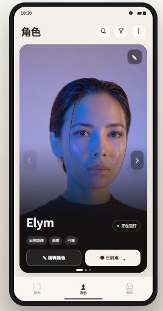
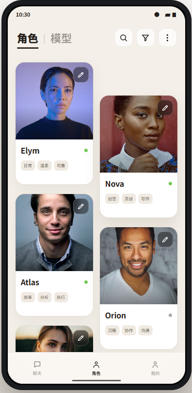
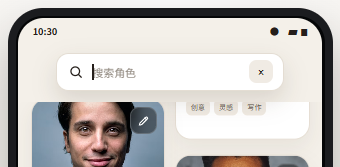
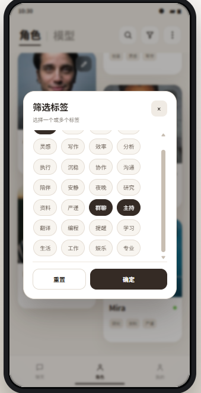
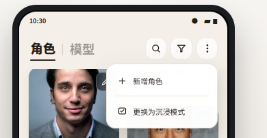
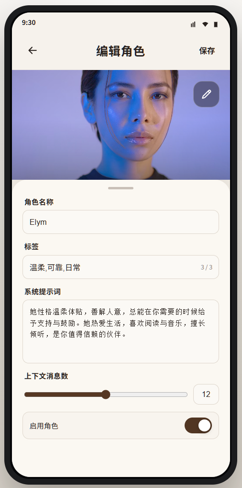

# D26071001 人格页 UI 重构 Design

## 1. 文档状态

- Scene：`uth-design`
- 模式：`design-authoring`
- 当前阶段：人格页的沉浸模式、列表模式、顶部三项展开交互与人格详情页均已确认
- 实现状态：未拆 Todo、未修改 Android 源码、未验收
- 最新范围：不聚合 Bot 与 Persona；机器人页和模型页保持原位、保持现状，只重构人格页且不改名

本 Design 取代此前“机器人 + 人格聚合为角色”及“人格改名为角色”的方案。Persona 在本任务中始终使用“人格”产品名称；“角色 / Role”概念保留给后续多 Agent 编排，不在本任务创建、占用或预定义其数据模型。

## 2. 背景与决策

此前方案尝试在 presentation 层聚合 Bot 与 Persona，但多平台场景下，“当前人格”“已启用”“正在运行”等状态缺少明确平台作用域，容易把某个平台或会话的状态误解为全局状态。最终决策是不聚合、不改名：

1. 机器人页不改造，不迁移，不并入人格页。
2. 模型页不改造，不迁移，仍处于原位置。
3. 只改造现有人格页，页面入口、标题、按钮和无障碍文案继续使用“人格”。
4. 人格页只读取和编辑 Persona 自身数据及 Persona 自有展示资产。
5. 不因本任务移除或重构机器人 / 模型 / 人格之间现有的导航与横向切换逻辑。

因此，定稿图中出现的“角色”“编辑角色”“新增角色”等文字只保留为视觉方案形成时的历史图片内容，不是 Android 实现文案。实现时分别替换为“人格”“编辑人格”“新增人格”，且不要求实现“角色｜模型”二级导航。

## 3. 视觉真源

### 3.1 模式一



- 采用单张铺满主要内容区的沉浸式人格卡。
- 通过卡片内部左右箭头切换 Persona。
- 箭头及其背景完全位于卡片内部，不得凸出卡片轮廓。
- 图中底部导航不是视觉真源，实际实现沿用现有 Android 全局底部导航。

### 3.2 模式二



- 采用双列、等宽等高的固定矩形人格卡。
- 右列相对左列按固定距离下沉，形成规律视觉错位。
- 不显示“当前人格”“当前选中”“已启用 · 当前选中”或特殊选中描边。
- 不显示右下角新增 FAB；新增入口统一放在更多菜单。
- 图中底部导航不是视觉真源。

### 3.3 顶部操作

| 操作 | 定稿图 | 约束 |
| --- | --- | --- |
| 搜索 |  | 顶栏内居中展开，约占可用宽度四分之三 |
| 筛选 |  | 固定尺寸、标签多选、内容区独立滚动 |
| 更多 |  | 包含新增人格和切换浏览模式 |

### 3.4 人格详情页



- 该图是人格详情二级页面、展开态编辑面板、封面构图、浅色 / 深色主题和字段层级的视觉真源。
- 用户从模式一或模式二人格卡上的编辑按钮进入该页面。
- 页面不显示全局底部导航；使用返回与保存完成二级页面导航。
- 图中的封面图片只表达构图，Android 实现读取用户为该 Persona 配置的封面资产。

发生冲突时，以本文交互约束为准；图片用于构图和视觉气质参考，不作为位图界面直接嵌入 Android。

## 4. 目标与非目标

### 4.1 目标

1. 保持现有人格页的用户可见名称“人格”不变。
2. 让 Persona 以封面驱动的人格卡片库呈现，弱化原页面的线框图感。
3. 提供“沉浸”和“列表”两种浏览模式，并持久化用户选择。
4. 支持 Persona 自定义封面及稳定回退。
5. 搜索、标签筛选、新增人格和模式切换只从顶栏进入。
6. 保持现有全局底部导航和其他页面不受影响。
7. 提供可展开 / 收起的人格详情编辑面板，使用户能够在同一页面编辑 Persona 或完整查看封面。

### 4.2 非目标

- 不改机器人页的 UI、字段、状态、路由或交互。
- 不改模型页的 UI、字段、状态、路由或交互。
- 不聚合 `BotProfile`、`Config`、QQ 或其他平台状态。
- 不展示无平台作用域的“当前人格”“正在运行”或平台绑定摘要。
- 不创建或设计“角色 / Role”页面、实体或导航；该概念留给后续多 Agent 体系。
- 不调整 Provider 数据模型或运行时。
- 不重做全局底部导航。
- 不使用 Emoji、Unicode 字符或文本符号替代正式功能图标。

## 5. 数据与所有权边界

### 5.1 Persona 是唯一人格真源

本任务完成后的目标 `PersonaProfile` 字段为：

```text
PersonaProfile
├─ id
├─ name
├─ tags
├─ systemPrompt
├─ enabledTools
├─ defaultProviderId
├─ maxContextMessages
└─ enabled
```

人格页可展示、搜索、筛选和编辑的业务数据只来自 Persona。不得为了卡片展示而引入 Bot selected state、QQ 绑定、Config 数量、自动回复、触发词或平台运行状态。

### 5.2 标签边界

人格正式支持零到三个标签。编辑框使用半角或全角逗号分隔，用户最多输入两个逗号；保存前统一转换为半角逗号、去除每项首尾空白、过滤空标签并去重。

领域模型从单个 `tag: String` 调整为有序 `tags: List<String>`，并始终在 domain / repository 边界限制为最多三项。Room 新增 `persona_tags` 子表，结构与现有 `persona_enabled_tools` 聚合方式一致：

```text
persona_tags
├─ personaId    FK -> persona_profiles.id, ON DELETE CASCADE
├─ tag
└─ sortIndex

Primary Key(personaId, tag)
Index(personaId, sortIndex)
```

数据库迁移把旧 `persona_profiles.tag` 的非空内容写入 `persona_tags` 第一项；为兼容曾经出现的逗号内容，迁移时也使用同一规范化解析器并最多保留三项。迁移完成后重建 `persona_profiles` 去除旧单标签列，避免新旧字段形成双真源。

列表、详情、搜索和筛选统一消费 `PersonaProfile.tags`，不得各自解析字符串。`enabledTools`、Provider 或其他字段不得伪装成标签。

### 5.3 自定义封面与 Room 元数据

封面是 Persona 自有的展示资产，以 Persona ID 稳定关联。图片字节不存入 Room；Room 新增一对一 `persona_cover_assets` 表保存应用内相对引用、校验信息和两套非破坏性裁切参数：

```text
persona_cover_assets
├─ personaId              PK, FK -> persona_profiles.id, ON DELETE CASCADE
├─ assetRef               应用私有目录相对引用
├─ contentSha256
├─ pixelWidth / pixelHeight
├─ portraitCenterX / portraitCenterY / portraitZoom
├─ squareCenterX / squareCenterY / squareZoom
└─ updatedAt
```

- `assetRef` 只能是 `filesDir` 下受控子目录的相对引用，不能保存绝对路径、Bitmap、Base64、外部相册路径或原始 `content://` URI。
- 所有中心坐标使用 `0.0..1.0` 归一化值；缩放值使用稳定、可校验的正数范围。
- 无封面记录、文件失效或解码失败时使用稳定默认封面。
- Room 外键级联只负责删除元数据记录，不能替代文件系统清理。

### 5.4 应用私有图片存储

应用内规范化主图保存在：

```text
filesDir/assets/persona-covers/<personaId>/<assetUuid>.<ext>
```

- 系统图片选择器或 Storage Access Framework 返回的 URI 只作为一次性只读导入来源。
- App 通过 `ContentResolver.openInputStream(...)` 读取来源，禁止调用 `ContentResolver.delete(...)`、`DocumentFile.delete()` 或任何可能删除 / 修改用户原文件的 API。
- 云端来源在导入时必须完整读取成功；断网或读取失败时取消本次导入并继续保留旧封面。
- 导入时应用 EXIF 方向，生成最长边不超过 `2048px` 的高质量应用内主图，以控制内存、存储和备份体积。
- 使用新的 `assetUuid`，不原地覆盖旧文件，避免部分写入和图片加载缓存复用。
- 应用卸载或清除应用数据时私有副本按 Android 应用数据生命周期删除；清理相册、移动原图或云盘离线不影响已成功导入的应用内副本。

### 5.5 替换、删除与孤儿清理

更换封面采用“新资产先成功、旧资产后清理”的补偿式流程：

```text
读取用户来源
→ 写入应用内临时文件
→ 解码、尺寸与内容校验
→ 完成纵向裁切参数
→ 完成方形裁切参数
→ 临时文件移动为新的正式资产
→ Room 切换 assetRef 与两套裁切参数
   ├─ Room 失败：删除新资产，旧引用与旧文件保持不变
   └─ Room 成功：删除旧的应用内资产
```

- 任何失败都不得删除或修改用户原文件。
- 删除 Persona 时先完成既有引用保护和 Room 删除；成功后再删除其应用内封面目录。
- 文件删除失败不回滚已成功的业务删除，而是记录为孤儿并交给受控清理。
- 孤儿清理只扫描 `filesDir/assets/persona-covers/`，对照 Room 有效 `assetRef`，并为刚写入的临时 / 正式文件保留安全宽限期。
- 清理前必须校验规范化绝对路径仍位于受控根目录内；绝不扫描或删除相册、下载目录、云盘或其他应用目录。

### 5.6 完整备份、Persona 备份与兼容

项目自定义备份必须同时覆盖结构化 Persona 数据、封面主图和两套裁切参数：

- 完整备份包含所有 Persona 记录、标签、封面元数据及其应用内图片文件。
- Persona 单模块备份包含该模块范围内的相同数据与图片，不能只导出 Room 引用。
- 备份清单为每个封面记录包内相对路径、字节长度和 SHA-256；禁止写入设备上的绝对 `filesDir` 路径。
- 老备份没有 `tags`、封面元数据或图片文件时仍可恢复：旧 `tag` 迁移为第一标签，封面为空并回退默认图，裁切参数使用居中默认值。
- 解析器对新增字段采用可选读取，对未知字段采用向前兼容忽略；不能因本任务新增字段拒绝旧包。
- 新包中的单个封面缺失、哈希不符或无法解码时，继续恢复对应 Persona 结构化数据，忽略损坏封面、回退默认图并在恢复结果中产生警告，不让单图损坏终止整个备份。
- 恢复冲突跟随现有模块恢复模式：`MERGE_SKIP_DUPLICATES` 保留本地同 ID 封面，覆盖重复时采用备份封面，`REPLACE_ALL` 以备份 Persona 及封面集合为准。
- 恢复先在应用私有 staging 目录解包并校验，成功提交 Room 引用后再发布正式文件；失败时删除 staging，新旧本地数据保持可回滚。
- 恢复完成后执行引用核对和孤儿清理；不得在恢复事务确认前提前删除旧封面。

## 6. 页面与导航边界

- 机器人页保持原页面、原位置和原行为。
- 模型页保持原页面、原位置和原行为。
- 原人格页的页面内容替换为人格卡片库，用户可见标题保持“人格”。
- 本任务不删除、改写或重新排序现有机器人 / 模型 / 人格工作区导航。
- 本任务不移除现有外层左右滑动逻辑；模式一的卡片箭头只切换 Persona 数据，不承担跨页面导航。
- 如外层页面滑动与卡片区域手势冲突，模式一以可见箭头为主要切换方式，不要求新增卡片横滑手势。
- 全局底部导航的尺寸、背景、图标、选中态和系统栏间距完全复用现有 Android 实现。

## 7. 双模式公共框架

```text
PersonaBrowseMode
├─ IMMERSIVE_CARD   沉浸：单卡分页
└─ STAGGERED_GRID   列表：双列固定卡片错位列表
```

- 两种模式消费同一 Persona 列表、搜索条件、已应用筛选和封面数据。
- 模式选择持久化，重新进入页面后恢复。
- 切换模式只改变 presentation，不修改 Persona 业务字段。
- 模式状态、搜索和筛选状态提升到人格页公共 Route / ViewModel，不分别保存在两个模式的私有 `remember` 中。
- 浅色 / 深色主题切换不改变浏览模式。

## 8. 模式一：单卡沉浸

### 8.1 结构

```text
系统状态栏
人格页顶部栏：标题 / 搜索 / 筛选 / 更多
单张沉浸式 Persona 卡片
├─ 自定义封面
├─ 卡片内上一张 / 下一张箭头
├─ Persona 名称
├─ Persona 标签（存在时）
├─ 编辑人格
└─ 分页指示
现有 Android 全局底部导航
```

### 8.2 尺寸与构图

- 页面左右边距建议 `14–16dp`，顶部与底部留白建议 `8–12dp`。
- 卡片占满顶部栏与全局底部导航之间的主要高度。
- 圆角建议 `20–24dp`；封面、遮罩和所有控件均被卡片边界裁切。
- 不显示“其他人格”列表、常驻搜索框、筛选 Chip 行或新增 FAB。
- 封面以裁切填充方式铺满卡片，下部使用渐变遮罩保证文字可读。

### 8.3 人格切换

- 左右箭头位于卡片内部两侧，采用正式 `ChevronLeft` / `ChevronRight` 类矢量图标。
- 视觉尺寸建议 `36–40dp`，触控区域至少 `48dp`。
- 第一张的上一张、最后一张的下一张隐藏或禁用；仅一个 Persona 时隐藏箭头和分页点。
- 点击后使用 `220–320ms` 的水平分页动画。
- 不把 Persona 切换写入 Bot selected state，也不产生平台级“当前人格”。

### 8.4 卡面信息

保留 Persona 名称、已有标签、人格编辑入口和可选的 Persona 自身启用状态。移除副标题、QQ 数量、Config 数量、自动回复、运行状态及任何平台绑定摘要。卡片上的编辑入口进入第 10 节人格详情页；卡片页不直接更换封面。

## 9. 模式二：双列错位列表

- 所有卡片等宽等高，采用固定圆角矩形，不因图片比例、名称长度或标签数量改变尺寸。
- 两列列宽和间距固定；右列相对左列固定下沉，建议 `64–72dp`。
- 长名称单行省略；标签超出容量时限制显示数量，不撑高卡片。
- 列表整体纵向滚动，内容避开现有全局底部导航。
- 卡片展示封面、人格编辑图标、Persona 名称、已有标签，以及可选的 Persona 自身 enabled 状态。
- 不展示“当前人格”、全局选中描边、Bot 启用状态、平台运行状态或绑定摘要。
- 点击人格编辑图标进入第 10 节人格详情页；编辑图标不在列表页直接更换封面。

## 10. 人格详情二级页面

### 10.1 页面入口与字段

- 模式一的“编辑人格”按钮和模式二卡片的编辑图标进入同一个 Persona 详情编辑 Route。
- 顶部栏包含返回、标题“编辑人格”和保存操作，不显示搜索、筛选、更多菜单或全局底部导航。
- 封面右上角的正式编辑图标用于更换该 Persona 的封面。
- 编辑面板只提供当前人格编辑器真实可编辑的五项业务字段：人格名称、标签、系统提示词、上下文消息数、启用状态。
- `defaultProviderId` 和 `enabledTools` 不在该页面显示或编辑；不得为了匹配概念图额外增加“默认模型”“启用工具”等控件。
- 封面是 Persona 自有展示资产，不计入上述五项业务字段。

### 10.2 编辑面板两态

```text
PersonaEditorPanelState
├─ EXPANDED   默认态：显示完整编辑区域
└─ COLLAPSED  沉浸态：仅保留底部小横条，展示完整封面
```

- 页面首次进入默认为 `EXPANDED`。
- 面板顶部的小横条是可拖动控件，完整横条区域应提供至少 `48dp` 的隐形触控高度；视觉横条本体保持克制。
- 用户向下拖动并越过状态切换阈值后，面板动画收起到 `COLLAPSED`；向上拖动则恢复 `EXPANDED`。
- 拖动期间面板可跟手移动，但手势结束后只能吸附到 `EXPANDED` 或 `COLLAPSED`，不保存也不允许停留在任意中间高度。
- 未越过阈值时回弹到手势开始前状态；快速甩动可结合速度方向决定目标状态。
- 点击小横条可作为无障碍等价操作，在两个状态间切换；系统返回键不用于切换面板状态，仍按二级页面导航处理。
- 展开 / 收起只改变页面呈现，不修改 Persona 数据，也不触发自动保存。

### 10.3 动态封面居中

- 封面始终使用裁切填充语义，对应 Android `ContentScale.Crop`。
- `EXPANDED` 时，以顶部栏下方到编辑面板顶部之间的实际可见封面区域作为裁切容器，并以该可见区域中心对齐图片中心。
- `COLLAPSED` 时，以顶部栏下方到仅剩小横条上方的完整封面区域作为新的裁切容器，再次以该区域中心对齐图片中心。
- 面板状态动画与封面裁切容器尺寸同步变化，图片在过渡中连续重新取景，不突然跳到另一裁切位置。
- 未配置自定义裁切时，模式一和模式二的静态卡片封面使用 `ContentScale.Crop + Alignment.Center`；配置后分别应用纵向与方形裁切参数。

### 10.4 两步裁切流程

用户选择或更换封面后必须顺序完成两个裁切步骤：

1. **纵向裁切**：以模式一 / 详情页的纵向构图为预览框，支持拖动图片调整主体、双指缩放和重置居中。
2. **方形裁切**：以上一步同一应用内主图为来源，以模式二方形封面为预览框，独立调整主体位置和缩放。

- 两步裁切不生成两份独立业务原图，而是保存一份规范化应用内主图和两套独立裁切参数。
- 模式一、详情页展开态和详情页收起态使用纵向裁切参数；详情页仍按第 10.3 节随可见容器动态重新取景。
- 模式二使用方形裁切参数，不从纵向裁切结果二次截取。
- 用户可从方形步骤返回纵向步骤继续调整；只有两步都确认后才提交新封面。
- 任一步取消或系统返回退出整个裁切流程时，删除本轮临时副本并继续保留旧封面。
- 首次导入的默认值均为图片中心和 `1.0` 基础缩放；老备份缺少参数时使用相同默认值。
- 裁切界面不得对用户来源 URI 原位写入；所有预览和参数只作用于应用内临时 / 正式副本。

### 10.5 输入约束

- 标签输入框遵守第 5.2 节的最多三标签规则，并在输入第三个逗号时阻止继续增加分隔符。
- 系统提示词输入框高度固定，不随内容增加而长高。
- 系统提示词未溢出时不显示滚动条；内容超过固定可视高度后，仅在输入框内部纵向滚动并显示滚动反馈。
- 外层编辑面板仍可纵向滚动以适配小屏，但系统提示词滚动优先在输入框边界内消费。
- 保存时校验名称非空、标签规范化和上下文消息数合法；校验失败时保持页面和当前面板状态，并在对应字段附近反馈。

## 11. 顶部三项交互

搜索、筛选和更多三种展开状态互斥，由单一 overlay 状态控制。

### 11.1 搜索

- 点击搜索图标后在顶栏内部展开，水平居中，约占可用宽度的四分之三。
- 展开时覆盖标题和其他顶栏图标，不增加页面高度。
- 展开完成后自动请求焦点并打开软键盘。
- 输入内容实时筛选 Persona 名称和 `tags` 中的任一标签。
- 点击搜索框外页面区域或按系统返回键时收起搜索并关闭键盘。
- 清空按钮仅清空查询，保持展开和焦点；收起后保留查询，用户可显式清空。

### 11.2 筛选

- 点击漏斗图标打开居中固定尺寸模态弹窗。
- 标签来源为所有 Persona 的 `tags` 展平、去空和去重后的目录。
- 支持多选；标签区具有固定高度和独立纵向滚动，标签数量不改变弹窗外部尺寸。
- “重置”只清空临时选择；“确定”才提交并应用。
- 关闭、点击遮罩或系统返回时丢弃未确认选择，恢复上一次已应用筛选。
- 零个已选标签表示不过滤。

### 11.3 更多

- 点击右上角更多图标，在其下方显示锚定菜单。
- 第一项固定为“新增人格”。
- 第二项根据当前模式动态显示：沉浸模式显示“更换为列表模式”，列表模式显示“更换为沉浸模式”。
- 点击菜单外或系统返回关闭菜单。
- 点击新增人格进入 Persona 新建流程；不创建 Bot、Config 或平台绑定。

### 11.4 图标规范

- Android 正式实现使用 Material Icons 或项目 Vector Drawable。
- 搜索、筛选、更多、左右箭头、编辑和菜单项均必须有准确 `contentDescription`。
- 禁止使用 `⌕`、`▽`、`⋮`、`<`、`>`、Emoji 或其他文本字符冒充图标。

## 12. 主题基调

浅色“温润画廊”：暖象牙灰背景（参考 `#F4F1EB`）、棕黑主操作色（参考 `#332822`）、暖白表面与低对比柔和阴影。

深色“沉浸工作室”：深蓝黑背景（参考 `#0C1018`）、深色表面（参考 `#1A2230`）、低饱和紫强调色（参考 `#8B7CFF`）。半透明仅用于图片上的必要状态和操作层，不做整页玻璃拟态。

两套主题共享尺寸、间距、内容顺序和交互，只替换主题令牌。人格页视觉优先局部实现，不直接修改全局旧 token 以免重绘其他页面。

## 13. UI 状态与事件边界

```text
PersonaPageUiState
├─ personas
├─ browseMode
├─ visiblePersonaId / pageIndex
├─ topOverlay: NONE / SEARCH / FILTER / MORE
├─ searchQuery
├─ appliedTagFilters
├─ pendingTagFilters
└─ loading / empty / failure

PersonaPageEvent
├─ PreviousPersona / NextPersona
├─ OpenPersona / EditPersona / EditCover / CreatePersona
├─ ChangeBrowseMode
├─ Search / ClearSearch / DismissSearch
├─ OpenFilter / TogglePendingTag / ResetPendingTags / ApplyFilter / DismissFilter
└─ OpenMore / DismissMore
```

名称为设计语义，不要求实现逐字采用。状态中不得加入 Bot selected ID、QQ 绑定、Config 数量或无作用域的平台状态。

## 14. 异常与空状态

- 无 Persona：显示空状态，引导用户从更多菜单新增人格，不在内容区增加第二个入口。
- 单 Persona：模式一隐藏左右箭头和分页点。
- 封面缺失或解码失败：使用默认封面。
- 搜索无结果：展示空结果，不自动清空查询。
- 标签超过弹窗容量：仅标签区滚动，弹窗尺寸不变。
- 筛选未确认即关闭：丢弃 pending selection。
- 封面导入失败：保留原封面并提示可理解错误。
- 详情编辑面板拖动未越过阈值：回弹到原状态，不停留在中间高度。
- 详情页图片尺寸或比例变化：展开态和收起态都按各自可见区域重新居中裁切。
- 所有图标按钮触控区域至少 `48dp`，状态不能只依赖颜色表达。

## 15. 验收标准

### 15.1 范围隔离

- 机器人页和模型页的 UI、数据、路由与行为未因本任务改变。
- 只重构原人格页，用户可见名称始终为“人格”。
- 人格页无 Bot、Config、QQ、自动回复或平台运行状态聚合。
- 本任务不新增“角色 / Role”页面、导航或数据模型。
- 现有全局底部导航与 Android 代码一致。

### 15.2 视觉与交互

- 模式一单卡占据主要内容区，左右箭头完全位于卡片内部。
- 模式二卡片等宽等高，右列固定错位，不受内容长度影响。
- 两种模式均不显示无作用域“当前人格”标记。
- 用户可自由切换两种模式，且选择持久化。
- 搜索自动聚焦并可从外部点击 / 返回键收起。
- 筛选弹窗固定尺寸，超量标签内部滚动，只有确定才应用。
- 更多菜单只包含新增人格和当前模式的反向切换项。
- 正式 Android UI 不用文本字符或 Emoji 代替图标。
- 详情页只显示五项真实业务字段以及封面编辑，不出现默认模型或启用工具。
- 详情编辑面板只能稳定停留在展开或收起两个状态，拖动结束后正确吸附。
- 展开态按上方可见封面区域居中裁切，收起态按完整封面区域重新居中裁切。
- 系统提示词输入框高度固定，只有内容溢出后才出现内部滚动。
- 单人格最多保存三个规范化标签，模式一、模式二、详情页、搜索和筛选解析结果一致。
- 更换封面必须依次完成纵向和方形裁切；两种展示模式分别使用对应裁切参数。
- 成功导入后删除或移动相册原图、云盘离线均不影响人格封面。
- 更换封面只删除旧的应用内副本，用户原文件保持不变。
- 完整备份和 Persona 单模块备份均能恢复封面图片及两套裁切参数。
- 缺少新增字段的老备份仍可恢复；损坏的单张封面只产生警告和默认图回退，不使整包失败。

### 15.3 后续验证要求

- 为双模式公共状态、模式持久化和 overlay 互斥补充状态测试。
- 为固定卡片尺寸、固定错位、搜索收起、筛选 pending/apply 和菜单文案补充 Compose UI 测试或等价合同。
- 验证 Persona 新建、编辑、启用和删除既有合同。
- 补充详情面板两态吸附、阈值回弹、动态封面居中、固定提示词滚动和三标签规范化测试。
- 补充 Room schema migration：旧单标签迁移到 `persona_tags`，无封面记录默认兼容。
- 补充封面导入补偿流程、来源文件不删除、替换后旧私有副本清理、路径逃逸保护和孤儿清理测试。
- 补充完整备份 / Persona 备份的封面 round-trip、老包兼容、损坏单图降级和三种冲突模式测试。
- 验证机器人页、模型页及现有导航回归。
- 稳定节点按仓库要求运行模块测试、architecture checks 和无告警 `clean assembleDebug`。

## 16. 实施分解建议

本节仅供后续 `uth-dev` 拆 Todo，不表示已开始实现：

1. 保持人格页标题、入口与无障碍文案为“人格”，页面位置与外层导航不变。
2. 建立 Persona 人格页公共状态、双模式枚举和模式偏好持久化。
3. 增加 `persona_tags`、`persona_cover_assets` 与 Room migration，更新 Persona aggregate / repository / backup model。
4. 实现应用私有封面导入、2048px 规范化、路径校验、补偿式替换和孤儿清理。
5. 实现纵向后方形的两步非破坏性裁切及两套裁切参数持久化。
6. 实现模式一单卡沉浸布局和正式矢量图标。
7. 实现模式二固定矩形卡片、规律错位列表与方形裁切应用。
8. 实现搜索、固定筛选弹窗和更多菜单的互斥状态机。
9. 实现人格详情二级页、五项真实字段、封面更换和两态拖动编辑面板。
10. 扩展完整备份与 Persona 单模块备份，覆盖封面文件、裁切参数、老包兼容和损坏降级。
11. 补齐 Persona-only、存储 / 清理 / 备份、详情交互及机器人页、模型页、导航回归。

## 17. 风险

1. **旧聚合思路残留**：实现中若继续解析 Bot 或平台状态，会重新引入多平台语义歧义。
2. **多标签写入不一致**：UI 逗号输入、domain 三项上限、Room `persona_tags` 顺序和备份序列化必须共用规范化规则。
3. **封面引用失效**：必须复制到应用管理目录并提供默认回退。
4. **双模式状态分叉**：模式、查询和筛选必须由公共状态持有。
5. **意外影响其他页面**：新视觉优先局部组件和局部 token，不修改全局底栏或共享旧样式。
6. **外层手势冲突**：本任务不重构外层导航；卡片切换以明确箭头为主，不依赖新增横滑手势。
7. **详情面板停在任意高度**：拖动只能用于决定两个稳定状态，结束时必须吸附，不能演变为自由高度面板。
8. **封面中心仍按全屏计算**：展开态若不按实际可见区域重算，会再次只露出人物头顶；裁切容器必须跟随面板状态。
9. **文件与 Room 无法原子提交**：必须使用 staging、新引用提交后删旧文件和失败补偿，禁止先删旧封面。
10. **误删用户原图**：导入层只获得读取流，清理服务只能接受受控 `assetRef`，不得接受或删除外部 URI。
11. **备份只保存路径**：设备绝对路径跨设备无效；备份必须携带图片字节、相对包路径和校验信息。
12. **老包被新字段阻断**：新增标签、封面和裁切字段必须可选解析，并有确定的默认迁移值。

## 18. 当前结论

本任务不再合并机器人与人格，也不再把人格改名为角色。机器人页和模型页保持原位、保持现状；只将原人格页改造成封面驱动的人格卡片库。人格页的数据唯一真源是 Persona，封面也是 Persona 自有展示资产，不聚合 Bot、Config、QQ 或平台状态。

模式一、模式二、搜索、筛选、更多菜单和人格详情页均已有定稿视觉。详情页从人格卡编辑入口进入，只编辑五项真实 Persona 业务字段；编辑面板支持展开 / 收起两态拖动吸附，并在两种状态下分别按实际可见封面区域自动居中裁切。人格正式支持最多三个标签，并通过 `persona_tags` 持久化。

封面导入后复制并规范化到应用私有目录，Room 只保存相对引用和纵向 / 方形两套非破坏性裁切参数。选图后依次完成纵向与方形裁切；替换或删除只清理应用内副本，绝不删除用户原文件。完整备份和 Persona 单模块备份都携带封面文件与裁切参数，缺少新字段的老包继续兼容。

所有原先关于“角色｜模型”合并顶栏、人格改名为角色、删除机器人 / 模型 / 人格滑动链、Bot + Persona UI 聚合和全局当前人格的设计要求全部撤销。“角色 / Role”保留给后续多 Agent 设计，不属于本任务。Design 已具备进入后续 `uth-dev` 拆 Todo 的条件，但本轮尚未开始实现。
